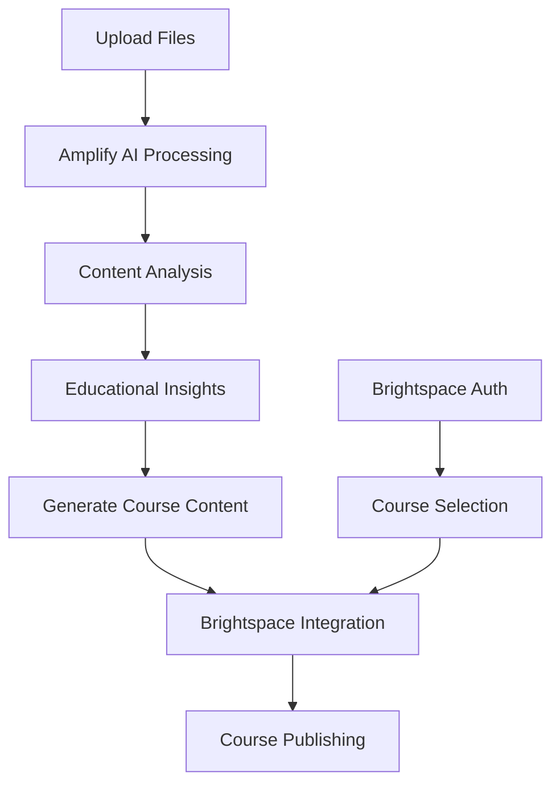

# 🚀 Amplify x Brightspace Integration

A modern, AI-powered file upload and processing system that integrates Amplify AI with Vanderbilt's Brightspace LMS for intelligent educational content creation.

## ✨ Features

### 🎯 Core Functionality
- **Modern File Upload Interface**: Beautiful drag-and-drop file upload with support for multiple file types
- **Amplify AI Integration**: Intelligent file processing and content analysis using AI
- **Brightspace LMS Integration**: Seamless publishing of AI-generated content to courses
- **Real-time Processing**: Live feedback and status updates during file processing
- **Course Management**: Direct integration with Brightspace courses and content structure

### 📁 Supported File Types
- **Documents**: PDF, DOC, DOCX, TXT
- **Spreadsheets**: CSV, XLS, XLSX
- **Presentations**: PPT, PPTX
- **Images**: PNG, JPG, JPEG, GIF
- **Media**: MP4, MP3 (basic support)

### 🤖 AI-Powered Features
- **Content Analysis**: Automatic topic extraction and summarization
- **Educational Insights**: Learning objectives and difficulty assessment
- **Quiz Generation**: Automatic quiz creation from uploaded content
- **Assignment Creation**: Smart assignment generation based on material analysis
- **Course Module Creation**: Structured course content organization

## 🚀 Quick Start

### Prerequisites
- Node.js 16+ installed
- Access to Vanderbilt Brightspace system
- Optional: Amplify API credentials (falls back to mock mode)

### Installation

1. **Clone and Install Dependencies**
   ```bash
   cd starter-package
   npm install
   ```

2. **Configure Environment**
   ```bash
   # Copy the example environment file
   cp .env.example .env
   
   # Edit .env with your credentials
   nano .env
   ```

3. **Start the Server**
   ```bash
   npm start
   # or for development
   npm run dev
   ```

4. **Access the Interface**
   Open http://localhost:3000 in your browser

## 🔧 Configuration

### Environment Variables

```env
# Brightspace Configuration (Required)
BRIGHTSPACE_CLIENT_ID=your_client_id
BRIGHTSPACE_CLIENT_SECRET=your_client_secret
BRIGHTSPACE_AUTH_URL=https://auth.brightspace.com/oauth2/auth
BRIGHTSPACE_TOKEN_URL=https://auth.brightspace.com/oauth2/token
BRIGHTSPACE_REDIRECT_URI=http://localhost:3000/auth/brightspace/callback
BRIGHTSPACE_API_BASE_URL=https://vanderbilt.brightspace.com/d2l/api

# Amplify AI Configuration (Optional - uses mock mode if not provided)
AMPLIFY_API_BASE_URL=https://api.amplify.ai
AMPLIFY_API_KEY=your_amplify_api_key

# Application Settings
PORT=3000
NODE_ENV=development
LOG_LEVEL=debug
```

## 📖 Usage Guide

### 1. Authentication
1. Click "Connect to Brightspace" on the main interface
2. Complete OAuth authentication with your Brightspace credentials
3. You'll be redirected back with authentication confirmed

### 2. File Upload
1. **Drag & Drop**: Drag files directly onto the upload zone
2. **Browse**: Click the upload zone to open file browser
3. **Multiple Files**: Upload up to 10 files simultaneously (50MB total limit)
4. **Review**: See uploaded files with details and remove if needed

### 3. Processing
1. **Select Course**: Choose target Brightspace course (if authenticated)
2. **Process Files**: Click "Process with Amplify AI" to start analysis
3. **Wait for Results**: AI processing typically takes 10-30 seconds
4. **Review Analysis**: See extracted topics, insights, and learning objectives

### 4. Publishing
1. **Review Generated Content**: Check AI-generated module structure
2. **Customize Actions**: Choose to create quizzes, assignments, or modules
3. **Publish to Brightspace**: Click "Publish to Brightspace" to add content to your course
4. **Verify**: Check your Brightspace course for the new content

## 🏗️ Architecture

### Frontend (`public/index.html`)
- Modern, responsive web interface
- Real-time file upload with drag-and-drop
- Live status updates and notifications
- Integrated course selection and management

### Backend Components

#### 1. Enhanced Server (`src/enhanced-server.js`)
- Main application server with Express.js
- File upload handling with Multer
- API endpoints for file processing and course management
- Integration coordination between Amplify and Brightspace

#### 2. Brightspace Client (`src/brightspace-client.js`)
- OAuth 2.0 authentication flow
- Brightspace API integration
- Course and content management
- Token refresh and session handling

#### 3. Amplify Client (`src/amplify-client.js`)
- AI-powered file processing
- Content analysis and extraction
- Educational content generation
- Mock mode for development (when API key not available)

## 🔄 API Endpoints

### Authentication
- `GET /auth` - Start Brightspace OAuth flow
- `GET /auth/brightspace/callback` - OAuth callback handler
- `GET /api/auth-status` - Check authentication status

### File Processing
- `POST /api/process-files` - Upload and process files with AI
- `GET /api/courses` - Get available Brightspace courses
- `POST /api/publish-to-brightspace` - Publish AI results to course

### Utility
- `GET /api/health` - System health check
- `GET /api/test-amplify` - Test Amplify AI integration

## 🔀 Workflow



## 🧪 Development

### Mock Mode
When `AMPLIFY_API_KEY` is not provided, the system runs in mock mode:
- Simulates AI processing with realistic sample data
- Allows full testing of the interface and workflow
- Generates sample educational content and insights

### Testing
```bash
# Test Amplify integration
npm run test-amplify

# Test Brightspace authentication
npm run test-auth

# Run legacy interface (original simple UI)
npm run legacy
```

### File Structure
```
starter-package/
├── src/
│   ├── enhanced-server.js      # Main server with AI integration
│   ├── amplify-client.js       # Amplify AI client
│   ├── brightspace-client.js   # Brightspace API client
│   ├── oauth-server.js         # Legacy OAuth server
│   └── example-usage.js        # Legacy example usage
├── public/
│   └── index.html              # Modern frontend interface
├── uploads/                    # Temporary file storage
├── package.json
├── .env                        # Environment configuration
└── README.md
```

## 🔒 Security Considerations

- **File Uploads**: Limited to 50MB total, 10 files maximum
- **File Types**: Restricted to educational file formats
- **OAuth**: Secure Brightspace authentication flow
- **Temporary Storage**: Uploaded files cleaned up after processing
- **API Keys**: Environment-based configuration

## 🐛 Troubleshooting

### Common Issues

1. **Authentication Failed**
   - Check Brightspace credentials in `.env`
   - Verify redirect URI matches configuration
   - Ensure Brightspace system is accessible

2. **File Upload Errors**
   - Check file size limits (50MB total)
   - Verify supported file types
   - Ensure uploads directory is writable

3. **Amplify Processing Issues**
   - Verify API key if using live mode
   - Check network connectivity to Amplify API
   - Review file formats and content

4. **Brightspace Publishing Failed**
   - Ensure authenticated with sufficient permissions
   - Verify course ID is valid and accessible
   - Check Brightspace API status

### Debug Mode
Enable detailed logging:
```env
LOG_LEVEL=debug
NODE_ENV=development
```

## 📚 Educational Use Cases

### 1. Course Content Creation
- Upload lecture slides or notes
- Generate structured course modules
- Create learning objectives automatically
- Organize content by topics and difficulty

### 2. Assessment Generation
- Upload textbooks or reference materials
- Generate quizzes and questions automatically
- Create assignments based on content analysis
- Develop rubrics and grading criteria

### 3. Multi-media Learning
- Process images, videos, and documents together
- Create comprehensive learning experiences
- Generate alternative content formats
- Enhance accessibility with AI insights

## 🤝 Contributing

1. Fork the repository
2. Create a feature branch: `git checkout -b feature-name`
3. Make your changes and test thoroughly
4. Commit with clear messages: `git commit -m "Add feature"`
5. Push and create a pull request

## 📄 License

MIT License - see LICENSE file for details

## 🙏 Acknowledgments

- Vanderbilt University for Brightspace access
- Amplify AI team for intelligent processing capabilities
- Contributors and testers

---

For support or questions, please open an issue or contact the development team.